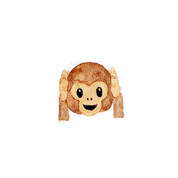

<div align="center">
<p align="center"></p>
<p align="center"><h2 align="center">CRAZYMOJI</h2></p>
<p align="center"> Exports All The Git Emojis As Json
</div>


## Why Use?
Why Keep Referencing Cheatsheets To Find Your Emojis? Simply Use This Module To Export 'Em All :sunglasses:

## Install
Run `npm install crazymoji` then add `const crazymoji = require('crazymoji)` to your working file :wink:

## Includes
- [x]  Smileys & Emotion
- [x]  People & Body
- [x]  Animals & Nature
- [x]  Food & Drink
- [x]  Travel & Places
- [x]  Activities
- [x]  Objects
- [x]  Symbols
- [x]  Flags
- [x]  GitHub Custom Emoji

## Usage
```js
 console.log(crazymoji.find('face'));
```
=> [
  ':face_with_thermometer:',
  ':face_with_head_bandage:',
  ':facepunch:',
  ':facepalm:',
  ':hot_face:',
  ':man_facepalming:',
  ':fox_face:',
  ':zany_face:',
  ':cold_face:',
  ':nerd_face:',
  ':wind_face:',
  ':trollface:',
  ':lying_facerelieved:',
  ':woozy_face:',
  ':dizzy_face:',
  ':tired_face:',
  ':clown_face:',
  ':woman_facepalming:',
  ':panda_face:',
  ':dragon_face:',
  ':neutral_face:',
  ':monocle_faceconfused:',
  ':yawning_facetriumph:',
  ':cursing_face:',
  ':pouting_face:',
  ':shushing_face:',
  ':drooling_face:',
  ':vomiting_face:',
  ':sneezing_face:',
  ':partying_facesunglasses:',
  ':frowning_face:',
  ':pleading_face:',
  ':sun_with_face:',
  ':nauseated_face:',
  ':crying_cat_face:',
  ':upside_down_face:',
  ':money_mouth_facehugs:',
  ':new_moon_with_face:',
  ':full_moon_with_face:',
  ':innocentsmiling_face_with_three_hearts:',
  ':slightly_smiling_face:',
  ':footprintsmonkey_face:',
  ':slightly_frowning_face:',
  ':thinkingzipper_mouth_face:',
  ':last_quarter_moon_with_face:',
  ':first_quarter_moon_with_face:',
  ':factory_worker:',
  ':racehorse:',
  ':factory:',
  ':macedonia:',
  ':space_invader:',
  ':peace_symbol:',
  ':office_worker:',
  ':office:',
  ':man_factory_worker:',
  ':topplace_of_worship:',
  ':page_facing_up:',
  ':exploding_headcowboy_hat_face:'
]


```js 
console.log(crazymoji.find('fAce        '));

```
=> 
[
  ':face_with_thermometer:',
  ':face_with_head_bandage:',
  ':facepunch:',
  ':facepalm:',
  ':hot_face:',
  ':man_facepalming:',
  ':fox_face:',
  ':zany_face:',
  ':cold_face:',
  ':nerd_face:',
  ':wind_face:',
  ':trollface:',
  ':lying_facerelieved:',
  ':woozy_face:',
  ':dizzy_face:',
  ':tired_face:',
  ':clown_face:',
  ':woman_facepalming:',
  ':panda_face:',
  ':dragon_face:',
  ':neutral_face:',
  ':monocle_faceconfused:',
  ':yawning_facetriumph:',
  ':cursing_face:',
  ':pouting_face:',
  ':shushing_face:',
  ':drooling_face:',
  ':vomiting_face:',
  ':sneezing_face:',
  ':partying_facesunglasses:',
  ':frowning_face:',
  ':pleading_face:',
  ':sun_with_face:',
  ':nauseated_face:',
  ':crying_cat_face:',
  ':upside_down_face:',
  ':money_mouth_facehugs:',
  ':new_moon_with_face:',
  ':full_moon_with_face:',
  ':innocentsmiling_face_with_three_hearts:',
  ':slightly_smiling_face:',
  ':footprintsmonkey_face:',
  ':slightly_frowning_face:',
  ':thinkingzipper_mouth_face:',
  ':last_quarter_moon_with_face:',
  ':first_quarter_moon_with_face:',
  ':factory_worker:',
  ':racehorse:',
  ':factory:',
  ':macedonia:',
  ':space_invader:',
  ':peace_symbol:',
  ':office_worker:',
  ':office:',
  ':man_factory_worker:',
  ':topplace_of_worship:',
  ':page_facing_up:',
  ':exploding_headcowboy_hat_face:'
]

```js
 console.log(crazymoji.find_exact('face_with'));
```
=> [ ':face_with_thermometer:', ':face_with_head_bandage:' ]


```js 
const emojis = crazymoji.get_raw();
crazymoji.emojify(emojis["Smileys & Emotion"]["Monkey Face"])
```
=> [ ':see_no_evil:', ':hear_no_evil:', ':speak_no_evil:' ]


## API
## Modules

<dl>
<dt><a href="#module_flattern">flattern</a> ⇒ <code>Array.&lt;string&gt;</code></dt>
<dd><p>Flatter/Merge a nested array of strings</p>
</dd>
<dt><a href="#module_get_raw">get_raw</a> ⇒ <code>Object</code></dt>
<dd><p>Get the RAW object containing all the emojis</p>
</dd>
<dt><a href="#module_categories">categories</a> ⇒ <code>Array</code></dt>
<dd><p>Get the list of categories of emojis</p>
</dd>
<dt><a href="#module_sub_categories">sub_categories</a> ⇒ <code>Array.&lt;string&gt;</code></dt>
<dd><p>Get sub-categories of emojis</p>
</dd>
<dt><a href="#module_filter_by_category">filter_by_category</a> ⇒ <code>object</code></dt>
<dd><p>Filter emojis by categories</p>
</dd>
<dt><a href="#module_emojify">emojify</a> ⇒ <code>array</code></dt>
<dd><p>Emojify an array</p>
</dd>
<dt><a href="#module_find">find</a> ⇒ <code>Array.&lt;string&gt;</code></dt>
<dd><p>Matches emojis using fUZZY logic</p>
</dd>
<dt><a href="#module_find_exact">find_exact</a> ⇒ <code>Array.&lt;string&gt;</code></dt>
<dd><p>Matches emojis using fUZZY logic</p>
</dd>
<dt><a href="#module_get_all_emojis">get_all_emojis</a> ⇒ <code>Array.&lt;string&gt;</code></dt>
<dd><p>List down all the emojis</p>
</dd>
</dl>

<a name="module_flattern"></a>

## flattern ⇒ <code>Array.&lt;string&gt;</code>
Flatter/Merge a nested array of strings

**Returns**: <code>Array.&lt;string&gt;</code> - - Merged/Flatter array  

| Param | Type | Description |
| --- | --- | --- |
| nested_array | <code>Array.&lt;string&gt;</code> | Nested array of category/sub_category |

<a name="module_get_raw"></a>

## get\_raw ⇒ <code>Object</code>
Get the RAW object containing all the emojis

**Returns**: <code>Object</code> - - The RAW data of all the emojis  
<a name="module_categories"></a>

## categories ⇒ <code>Array</code>
Get the list of categories of emojis

**Returns**: <code>Array</code> - string - List of emoji categories  
<a name="module_sub_categories"></a>

## sub\_categories ⇒ <code>Array.&lt;string&gt;</code>
Get sub-categories of emojis

**Returns**: <code>Array.&lt;string&gt;</code> - - List of sub categories with their parent categories  
<a name="module_filter_by_category"></a>

## filter\_by\_category ⇒ <code>object</code>
Filter emojis by categories

**Returns**: <code>object</code> - string - List of emojis filtered by the given category  

| Param | Type | Description |
| --- | --- | --- |
| category | <code>string</code> | Exact emoji category name |

<a name="module_emojify"></a>

## emojify ⇒ <code>array</code>
Emojify an array

**Returns**: <code>array</code> - string  

| Param | Type | Description |
| --- | --- | --- |
| sub_category | <code>Array</code> | The sub category |

<a name="module_find"></a>

## find ⇒ <code>Array.&lt;string&gt;</code>
Matches emojis using fUZZY logic

**Returns**: <code>Array.&lt;string&gt;</code> - - Array of matched emojis  

| Param | Type | Description |
| --- | --- | --- |
| emoji_pattern | <code>string</code> | name (case insensitive) of the pattern |

<a name="module_find_exact"></a>

## find\_exact ⇒ <code>Array.&lt;string&gt;</code>
Matches emojis using fUZZY logic

**Returns**: <code>Array.&lt;string&gt;</code> - - Array of matched emojis  

| Param | Type | Description |
| --- | --- | --- |
| emoji_pattern | <code>string</code> | name (case insensitive) of the pattern |

<a name="module_get_all_emojis"></a>

## get\_all\_emojis ⇒ <code>Array.&lt;string&gt;</code>
List down all the emojis

**Returns**: <code>Array.&lt;string&gt;</code> - - List of all the emojis  


## Looking For A Cheatsheet ?
[crazymoji cheatsheet](./cheatsheet.md)

## Other works
[qikQR](https://girhub.com/deep5050/qikQR) . [autobadge](https://girhub.com/deep5050/autobadge) . [nonsense-license](https://girhub.com/deep5050/nonsense) . [qikstart](https://girhub.com/deep5050/qikstart)